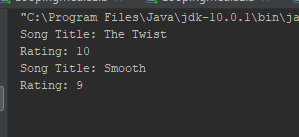

This Repo is for students to better organize your work

------------------------------------------------------------------------ 
This is the project README file. Here, you should describe your project. 
Tell the reader (someone who does not know anything about this project) 
all he/she needs to know. The comments should usually include at least: 
------------------------------------------------------------------------

<h2>PROJECT TITLE:1.2.1 </h2>

# Lesson 1.2.1 
<li>PURPOSE OF PROJECT: Parsing Text                             </li>
<li>VERSION or DATE:3/11/20                                 </li>
<li>HOW TO START THIS PROJECT:                       </li>
<li>AUTHORS:Deondra Thomas                                         </li>
<li>USER INSTRUCTIONS:                               </li>

#3. "System.out.println("Rating: " + rating);" gets the rating . And "System.out.println("Title + title" gets the title
#21. The while loop, because im used to doing while loop i've never use the for loop
Conclusion Questions: 
1. While (condition) { 
                             // code
                             // so-called "loop body"
                           }
for (let i = 0; i < 3; i++) { // shows 0, then 1, then 2
  alert(i);
}
While loop is good because its more easier then a for loop, it has less coding involved. And For loops are good for creating games.
2. The major change in Android Os 3.0 they fixed bugs, changed the Android API, and added a system bar. And Gingerbread became cumbersome because it's and old version so its harder to use.

    

------------------------------------------------------------------------ 
 This is the project README file. Here, you should describe your project. 
Tell the reader (someone who does not know anything about this project) 
all he/she needs to know. The comments should usually include at least: 
------------------------------------------------------------------------

# Lesson Insert Number Here
<li>PURPOSE OF PROJECT:                              </li>
<li>VERSION or DATE:                                 </li>
<li>HOW TO START THIS PROJECT:                       </li>
<li>AUTHORS:                                         </li>
<li>USER INSTRUCTIONS:                               </li>

#?  EXAMPLE Insert question you are answering here 

#?  EXAMPLE Insert question you are answering here 

#?  EXAMPLE Insert question you are answering here 

------------------------------------------------------------------------ 
This is the project README file. Here, you should describe your project. 
Tell the reader (someone who does not know anything about this project) 
all he/she needs to know. The comments should usually include at least: 
------------------------------------------------------------------------

# Lesson Insert Number Here
<li>PURPOSE OF PROJECT:                              </li>
<li>VERSION or DATE:                                 </li>
<li>HOW TO START THIS PROJECT:                       </li>
<li>AUTHORS:                                         </li>
<li>USER INSTRUCTIONS:                               </li>

#?  EXAMPLE Insert question you are answering here 

#?  EXAMPLE Insert question you are answering here 

#?  EXAMPLE Insert question you are answering here 

------------------------------------------------------------------------ 
This is the project README file. Here, you should describe your project. 
Tell the reader (someone who does not know anything about this project) 
all he/she needs to know. The comments should usually include at least: 
------------------------------------------------------------------------

# Lesson Insert Number Here
<li>PURPOSE OF PROJECT:                              </li>
<li>VERSION or DATE:                                 </li>
<li>HOW TO START THIS PROJECT:                       </li>
<li>AUTHORS:                                         </li>
<li>USER INSTRUCTIONS:                               </li>

#?  EXAMPLE Insert question you are answering here 

#?  EXAMPLE Insert question you are answering here 

#?  EXAMPLE Insert question you are answering here 

------------------------------------------------------------------------ 
This is the project README file. Here, you should describe your project. 
Tell the reader (someone who does not know anything about this project) 
all he/she needs to know. The comments should usually include at least: 
------------------------------------------------------------------------

# Lesson Insert Number Here
<li>PURPOSE OF PROJECT:                              </li>
<li>VERSION or DATE:                                 </li>
<li>HOW TO START THIS PROJECT:                       </li>
<li>AUTHORS:                                         </li>
<li>USER INSTRUCTIONS:                               </li>

#?  EXAMPLE Insert question you are answering here 

#?  EXAMPLE Insert question you are answering here 

#?  EXAMPLE Insert question you are answering here 

------------------------------------------------------------------------ 
This is the project README file. Here, you should describe your project. 
Tell the reader (someone who does not know anything about this project) 
all he/she needs to know. The comments should usually include at least: 
------------------------------------------------------------------------

